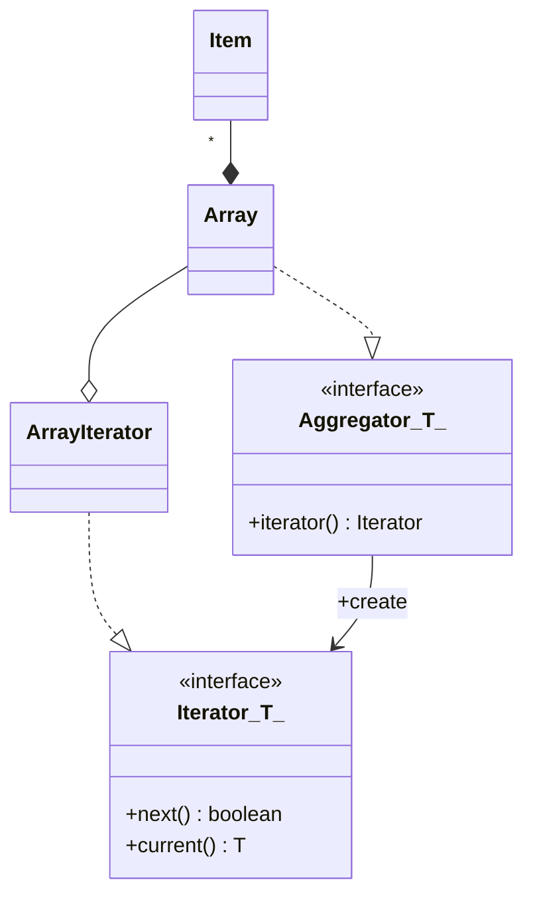

```mermaid
classDiagram
    class Iterator_T_ {
        <<interface>>
        +next() boolean
        +current() T
    }

    class Aggregator_T_ {
        <<interface>>
        +iterator() Iterator
    }

    class ArrayIterator

    class Array

    class Item

    ArrayIterator ..|> Iterator_T_
    Array ..|> Aggregator_T_
    Item "*" --* Array
    Aggregator_T_ --> Iterator_T_ : +create
    Array --o ArrayIterator


```
